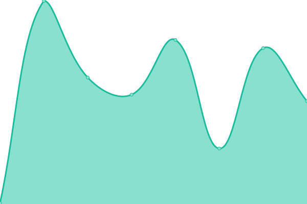

# [📈 Live Status](https://up.c0d3.ch): <!--live status--> **🟩 All systems operational**

This repository contains the open-source uptime monitor and status page for [Philipp Marmet](https://c0d3.ch), powered by [Upptime](https://github.com/upptime/upptime).

With [Upptime](https://upptime.js.org), you can get your own unlimited and free uptime monitor and status page, powered entirely by a GitHub repository. We use [Issues](https://github.com/fujexo/upptime/issues) as incident reports, [Actions](https://github.com/fujexo/upptime/actions) as uptime monitors, and [Pages](https://up.c0d3.ch) for the status page.

<!--start: status pages-->
<!-- This summary is generated by Upptime (https://github.com/upptime/upptime) -->
<!-- Do not edit this manually, your changes will be overwritten -->
<!-- prettier-ignore -->
| URL | Status | History | Response Time | Uptime |
| --- | ------ | ------- | ------------- | ------ |
|  [c0d3 Website](https://c0d3.ch) | 🟩 Up | [c0d3-website.yml](https://github.com/fujexo/upptime/commits/HEAD/history/c0d3-website.yml) | 

 485ms
     
 | 

<a href="https://up.c0d3.ch/history/c0d3-website">100.00%</a>
    

|  [upptime](https://up.c0d3.ch) | 🟩 Up | [upptime.yml](https://github.com/fujexo/upptime/commits/HEAD/history/upptime.yml) | 

 149ms
     
 | 

<a href="https://up.c0d3.ch/history/upptime">100.00%</a>
    

|  BookStack | 🟩 Up | [book-stack.yml](https://github.com/fujexo/upptime/commits/HEAD/history/book-stack.yml) | 

 860ms
     
 | 

<a href="https://up.c0d3.ch/history/book-stack">100.00%</a>
    

|  Partkeepr | 🟩 Up | [partkeepr.yml](https://github.com/fujexo/upptime/commits/HEAD/history/partkeepr.yml) | 

 700ms
     
 | 

<a href="https://up.c0d3.ch/history/partkeepr">100.00%</a>
    

|  Grafana | 🟩 Up | [grafana.yml](https://github.com/fujexo/upptime/commits/HEAD/history/grafana.yml) | 

 787ms
     
 | 

<a href="https://up.c0d3.ch/history/grafana">100.00%</a>
    

|  InfluxDB | 🟩 Up | [influx-db.yml](https://github.com/fujexo/upptime/commits/HEAD/history/influx-db.yml) | 

 450ms
     
 | 

<a href="https://up.c0d3.ch/history/influx-db">100.00%</a>
    

<!--end: status pages-->

[**Visit our status website →**](https://up.c0d3.ch)

## 📄 License

- Powered by: [Upptime](https://github.com/upptime/upptime)
- Code: [MIT](./LICENSE) © [Philipp Marmet](https://c0d3.ch)
- Data in the `./history` directory: [Open Database License](https://opendatacommons.org/licenses/odbl/1-0/)
